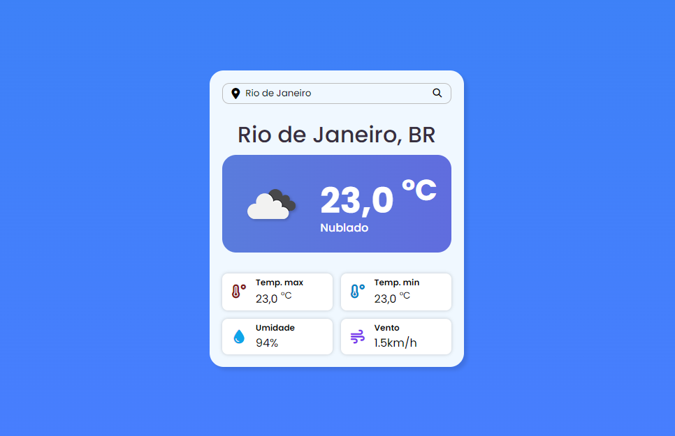

<h1 align="center">Site de Previsão do Tempo</h1>

  
  
  

  <a href="#-tecnologias">Tecnologias</a>&nbsp;&nbsp;&nbsp;|&nbsp;&nbsp;&nbsp;
  <a href="#-projeto">Projeto</a>&nbsp;&nbsp;&nbsp;

 

  

<h4 align="center">
  
  [Ver projeto](https://gabrielcenteiofreitas.github.io/WeatherForecast-Project/)
</h4>

 

## 🚀 Tecnologias

Esse projeto foi desenvolvido com as seguintes tecnologias:

- HTML
- CSS
- JavaScript

## 💻 Projeto

Projeto de um site de Previsão do Tempo integrado à API Open Weather feito com HTML, CSS e JS a partir do vídeo: https://youtu.be/t_GdX1iLYQE

Você pode acessá-lo clicando [aqui](https://gabrielcenteiofreitas.github.io/FindTheClosestTailwindColors/).

## 👨🏻‍💻 Autor: Gabriel Centeio Freitas 

  
  

